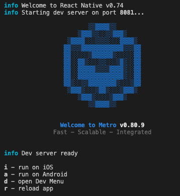

# ChatApp

Instructions for setting up and running the project.

## Step 1: Install Dependencies
```bash
# Install dependencies with npm
npm install

# Install CocoaPods dependencies
cd ios
pod install
```

## Step 2: Start  Metro Bundler
In a separate terminal, run:

```bash
# using npm
npm start
```

## Step 3: Run on Simulator/Emulator
You should now be able to run the app on the iOS simulator or Android emulator by typing **i** or **a** respectively.

You must initialize at least two instances of the project to test its core functionality.



Alternatively, you can also run the app directly from Xcode or Android Studio.